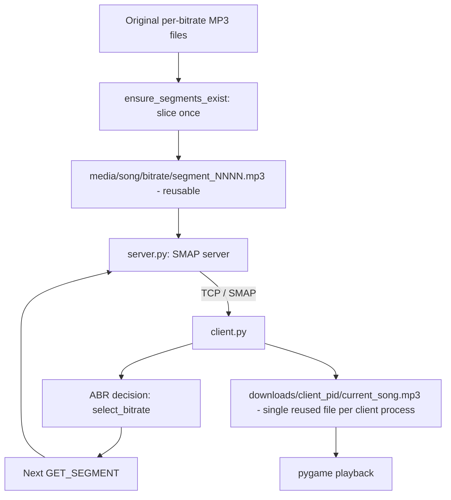
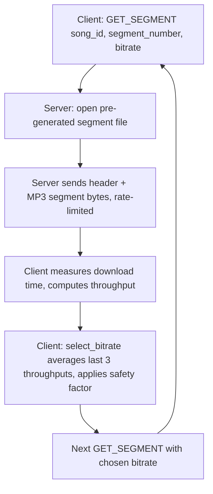

# MiniMP3Stream (SMAP Protocol)

**Project 1  Socket Programming: Adaptive-bitrate MP3 streaming client/server**

MiniMP3Stream is a TCP client/server music streaming application built around a custom, text-based application-layer protocol called **SMAP (Simple Music Adaptive Protocol)**. The server exposes a catalog of songs, each available at multiple MP3 bitrates, and streams audio data to the client over a single persistent TCP connection.

The client supports **Adaptive Bitrate (ABR)** streaming: it requests the song one fixed-size segment at a time, measures how fast each segment actually downloaded, and uses that measurement to pick the bitrate for the *next* segment  all capped by a user-configurable **Preferred Bitrate**, which acts as a hard ceiling the algorithm will never exceed regardless of how fast the network is.

To make ABR behavior easy to demonstrate without a real unstable network, the server also includes a **network simulation** feature: a bandwidth profile (`GOOD` / `NORMAL` / `POOR`) that genuinely throttles how fast segment bytes are sent, so the client's throughput measurements  and therefore its bitrate decisions  respond to real, controllable conditions. This can be set as a shared operator default, or **pinned independently per client** (see Section 11).

The server supports **multiple simultaneous clients**: it accepts new connections on a thread-per-client model, and every client's session state (preferred bitrate, current song/segment, ABR history on the client side, and now network-simulation profile) is fully isolated from every other client's  see Section 2a.

---
## Project Scope

SMAP is a custom, educational application-layer protocol created for this Socket Programming project. It is **not** an implementation of MPEG-DASH, HLS, or any standardized streaming protocol  there is no manifest file, no frame-accurate segment alignment across bitrates, and no compatibility claim with DASH/HLS tooling.

The project borrows the basic idea of segmented, adaptive streaming (request small pieces, adapt bitrate between pieces) but implements its own message format, its own segmentation scheme (fixed byte ranges per bitrate file, pre-sliced once and reused), and its own bitrate-selection algorithm, as described above.

## 1. Features
- **Multiple simultaneous clients**, each with its own thread and its own fully isolated session state (preferred bitrate, streaming flag, network-simulation override); one client's requests, errors, or disconnects never affect any other connected client or the serve's ability to accept new ones
- TCP client/server communication (`socket`, thread-per-client on the server), with **one persistent connection per client** that stays open across multiple songs, replays, and preference changes until `QUIT`
- Custom SMAP text-based application-layer protocol (request line + response header block)
- Song catalog listing (`LIST`) with per-song available bitrates
- Whole-file streaming at a single bitrate (`PLAY`)  legacy/non-adaptive path
- Segment-by-segment streaming (`GET_SEGMENT`) for adaptive playback, served from **pre-generated, reusable segment files** (see Section 8)
- Four supported MP3 bitrates: 64, 128, 192, 320 kbps
- User-configurable **Preferred Bitrate**, enforced both server-side (informational) and client-side (used directly by the ABR algorithm as a hard cap)
- Adaptive Bitrate (ABR) selection based on measured per-segment throughput
- Throughput history averaging (last 3 segments) with a safety margin applied before choosing the next bitrate
- Fixed-size byte-range media segmentation, sliced into physical files once and reused (not regenerated per request/session)
- A single reusable client-side playback file per client process (`downloads/client_<pid>/current_song.mp3`)  replaying a song, or playing a different one, truncates and reuses the same file instead of creating new ones; running several `client.py` processes on the same computer no longer collide on one shared file (see Section 2b)
- Simple console **playback status** display (`IDLE` / `PLAYING` / `FINISHED` / `STOPPED`)
- Live network simulation, server-side (`GOOD` / `NORMAL` / `POOR`) with real bandwidth throttling  settable as a shared global default (operator console / `--network`) **or pinned independently per client** with the new `NETWORK` command, so different clients can demo different network conditions at the same time
- SMAP status codes and status phrases (200, 400, 404, 406, 500  see Section 6)
- Local MP3 playback via `pygame`
- Console logging of every SMAP request/response, network measurement, and adaptation decision  every server-side log line is tagged `[CLIENT host:port]` and printed under a shared lock so concurrent clients` output doesn`t interleave mid-block

## 2. Project Architecture

**`client.py`**
- Presents a text menu (List Songs, Play Song, Set Preferred Bitrate, Stop, Set Network Simulation, Quit)
- Connects to the server over TCP **once** and reuses that same connection for every command in the session, including replaying songs, until `QUIT`
- Parses SMAP responses via `protocol.py` helpers
- For "Play Song": issues repeated `GET_SEGMENT` requests, measures download time with `time.perf_counter()`, computes throughput, and calls `select_bitrate()` to choose the bitrate for the next segment
- Writes every playback session (first play, replay, or a different song) into the **same** file, `downloads/client_<pid>/current_song.mp3` (its own per-process subfolder  see Section 2b), truncating/overwriting it each time, and plays it back with `pygame`
- Tracks and prints a `[PLAYBACK]` status block (`PLAYING` / `FINISHED` / `STOPPED`) as playback moves through its lifecycle
- Every `client.py` process is its own OS process with its own module-level state (preferred bitrate, playback status, socket)  running several of them at once (see Section 2a) never shares state between them, since each is a completely separate Python interpreter

**`protocol.py`**
- Defines the SMAP wire format (request line, response header block, delimiters)
- `BufferedSocket`: buffers raw socket data so message boundaries and exact-length reads (`read_until`, `read_exact`) are handled correctly over a TCP byte stream
- Request/response encode-decode helpers: `build_request`, `send_request`, `receive_request`, `build_response`, `send_response_header`, `receive_response_header`
- Status codes/phrases table (`STATUS_PHRASES`)
- ABR building blocks: `AVAILABLE_BITRATES`, `SEGMENT_SIZE_BYTES`, `THROUGHPUT_HISTORY_SIZE`, `SAFETY_FACTOR`, `calculate_throughput_kbps()`, `select_bitrate()`
- Unchanged in this revision  the existing wire format already supported everything the new server/client behavior needed

**`server.py`**
- Accepts TCP connections on a thread-per-client model  the main thread loops on `accept()` and hands each new connection to its own daemon thread, so it is always ready to accept the next client no matter what any currently-connected client is doing
- The per-client loop only exits on `QUIT` or a real connection error, so one song finishing (or another client connecting) never closes this connection
- Builds a song catalog by scanning a `songs/` directory at startup, then calls `ensure_segments_exist()` for every (song, bitrate) pair to pre-slice each bitrat's MP3 into physical, reusable segment files under `media/` (generated once, reused on every future request, every client, and every server restart)
- Handles all SMAP commands: `LIST`, `PLAY`, `GET_SEGMENT`, `BITRATE`, `NETWORK`, `STOP`, `QUIT`
- Streams whole files (`PLAY`) or pre-generated segment files (`GET_SEGMENT`)  no per-request or per-session slicing happens anymore
- Implements network simulation: a shared global bandwidth profile with live switching via server console input, **plus an optional per-client override** (`NETWORK` command) so one client's simulated conditions never affect anothe's
- Every connection's own `state` dict (preferred bitrate, streaming flag, network-profile override) is local to its handler thread  never a module-level global  so concurrent clients cannot see or modify each othe's session (see Section 2a)

## 2a. Multi-Client Support

The server was extended from single-client to **multi-client** without changing the SMAP wire protocol, the ABR algorithm, media segmentation, or replay behavior. Summary of what makes concurrent clients safe:

| Concern | How it's handled |
|---|---|
| Accepting new clients | `main()` loops on `server_sock.accept()` and starts a new daemon thread per connection  it never blocks waiting for an existing client to finish (thread-per-client) |
| Per-client session state | `handle_client()` creates a local `state` dict (`preferred_bitrate`, `streaming`, `network_profile`) per connection  never stored in a module-level global, so one client's `BITRATE`/`NETWORK` choice cannot leak into anothe's |
| ABR | Stays entirely client-side, in `client.py`'s local variables (`throughput_history`, `current_bitrate`)  every separate `client.py` process has its own, since each is its own OS process |
| Preferred bitrate | Server-side copy lives in the per-connection `state` dict; client-side copy lives in `client.py`'s `PREFERRED_BITRATE` global, which is process-local (one process per client) |
| Network simulation | A shared GLOBAL default profile (unchanged from before) still exists for operator convenience, but a client can now pin its **own** profile with `NETWORK <PROFILE>`, stored only in its `state` dict  see Section 11 |
| Server-side media segments | Read-only after startup (`ensure_segments_exist()` only ever runs once, synchronously, before any client thread exists)  safe for any number of clients to read the same segment files concurrently, no lock needed |
| Client-side `current_song.mp3` | Isolated two ways: each `client.py` is its own OS process, AND (new) each process now writes into its own `downloads/client_<pid>/` subfolder rather than a shared `downloads/` root  see Section 2b. This is what stops two `client.py` instances running on the **same** computer from hitting a Windows `[Errno 13] Permission denied` error on a shared file. |

## 2b. Per-Client Playback Directory (same-machine multi-client fix)

**Problem this section fixes:** the isolation described in Section 2a assumed each client ran as its own OS process, which is normally enough  except when several `client.py` processes run on the **same** computer (e.g. three terminals on one Windows PC for a demo). In that case they all resolved `DOWNLOADS_DIR` to the same folder and all wrote to the same `downloads/current_song.mp3`. If one process still had that file open for playback (or mid-write) while another tried to truncate/overwrite it, Windows raised `[Errno 13] Permission denied` and the second client's connection was dropped.

**Fix (in `client.py` only  no server/protocol changes):** each running `client.py` process now resolves its playback file to its own subfolder, named after its own OS process ID:

```
downloads/
├── client_<pid_1>/
│   └── current_song.mp3
├── client_<pid_2>/
│   └── current_song.mp3
└── client_<pid_3>/
    └── current_song.mp3
```

- `CLIENT_ID = os.getpid()`  the operating system already guarantees this is unique among every process currently running on the machine, so no server round-trip, coordination file, or lock is needed to hand out an ID.
- The filename inside that subfolder is still exactly `current_song.mp3`  replay/overwrite behavior (Section 9) is completely unchanged; only the directory that keeps one client's file away from another's is new.
- At startup, the client prints `[INFO] This client's local playback directory: downloads/client_<pid>` so it's easy to tell terminals apart during a same-machine multi-client demo.
- Directories are not automatically deleted on `QUIT` (left as an optional future cleanup step)  removing a still-open file on Windows can itself raise a locking error, so the safer default is to just leave small, empty-ish per-client folders behind between runs.
| Thread safety / shared resources | `catalog` is built once before the accept loop and only ever read afterward; the network-profile global is guarded by a small `threading.Lock`; console output is serialized with a print lock and tagged `[CLIENT host:port]` so concurrent clients` logs don`t interleave mid-block |
| Error isolation | Each client's request loop has its own try/except; an exception (bad request, dropped socket, unexpected error) only ends that client's thread  the main server loop and every other client's thread are unaffected |
| Shutdown | Ctrl+C in the server terminal still stops `main()`; client handler threads are daemon threads, so they don't block process exit |

**Why this was safe to add without a redesign:** the original server already processed one client per thread and already kept preferred-bitrate/streaming state in a per-connection dict  it only needed (1) a per-client override for the previously-global network profile, and (2) clearer per-client log tagging. Nothing about the SMAP protocol, segmentation, or ABR algorithm changed.

### Architecture diagram



### Segment request/response flow (adaptive path)



## 3. Prerequisites

From the actual imports in the source files:

- **Python 3** (standard `socket`, `threading`, `time`, `json`, `os`, `argparse` modules are used  all part of the standard library, no version pin is specified in the code)
- **pygame**  used by `client.py` for MP3 playback (`pygame.mixer`)

No `requirements.txt` file was provided, so install the one third-party dependency directly:

```bash
pip install pygame
```

To verify your Python installation:

```bash
python --version
python -c "import pygame; print(pygame.ver)"
```

`server.py` has no third-party dependencies  it only imports standard library modules plus the project's own `protocol.py`.

## 4. Folder Structure

Based on `SONGS_DIR`/`MEDIA_DIR` in `server.py` and `DOWNLOADS_DIR` in `client.py`, both resolved relative to each script's own location:

```
MiniMP3Stream/
│
├── client.py
├── server.py
├── protocol.py
│
├── songs/                      # you create this  original per-bitrate MP3s, scanned by server.py at startup
│   └── <song_name>/
│       ├── <song_name>_64.mp3
│       ├── <song_name>_128.mp3
│       ├── <song_name>_192.mp3
│       └── <song_name>_320.mp3
│
├── media/                      # created automatically by server.py (ensure_segments_exist)
│   └── <song_name>/            # SERVER-SIDE, reusable across every client and every restart
│       ├── 64/
│       │   ├── segment_0001.mp3
│       │   ├── segment_0002.mp3
│       │   └── ...
│       ├── 128/
│       │   └── ...
│       ├── 192/
│       │   └── ...
│       └── 320/
│           └── ...
│
├── downloads/                   # created automatically by client.py
│   ├── client_<pid_1>/          # one subfolder per running client.py process (Section 2b)
│   │   └── current_song.mp3     # CLIENT-SIDE  this client's ONLY playback file, reused for every play/replay
│   ├── client_<pid_2>/
│   │   └── current_song.mp3
│   └── ...
│
└── README.md
```

The server does **not** require all four bitrate files to be present for a song  `build_catalog()` only registers whichever `<song_name>_<bitrate>.mp3` files it actually finds inside each son's subfolder, and only slices segments for the bitrates that exist. A song is only added to the catalog if at least one matching bitrate file exists.

The client never creates `current_song_1.mp3`, `song_play_2.mp3`, timestamped filenames, or anything similar  every "Play Song" (first time, replay of the same song, or a different song) opens this client's own `downloads/client_<pid>/current_song.mp3` in write mode, which truncates whatever was there before and starts fresh. See Section 2b for why each client process gets its own subfolder.

## 5. How to Add Music Files

1. Inside the project folder, create a `songs/` directory next to `server.py` (if it doesn`t already exist).
2. Inside `songs/`, create one subfolder per song. The **subfolder name becomes the song name** shown by `LIST`.
3. Inside each son's subfolder, place MP3 files named exactly:

   ```
   <folder_name>_64.mp3
   <folder_name>_128.mp3
   <folder_name>_192.mp3
   <folder_name>_320.mp3
   ```

   For example, a subfolder named `mysong` must contain files like `mysong_64.mp3`, `mysong_128.mp3`, etc.
4. You do **not** need all four bitrate files  the server registers only the bitrates it finds (`build_catalog()` checks each of `AVAILABLE_BITRATES = [64, 128, 192, 320]` for a matching file and only adds the ones present).
5. Restart the server after adding or changing files  the catalog is built once at startup (`build_catalog()` is called from `main()`), so newly added files are not picked up while the server is already running.
6. Song IDs are assigned automatically, starting at 1, in the sorted order of the subfolder names.
7. On startup, the server also (re)generates reusable media segments for any new files  see Section 8 and the `[MEDIA]` log lines printed at startup.

## 6. SMAP Protocol Overview

- **Transport:** TCP, request/response, one command processed at a time per connection (thread-per-client on the server).
- **Request format:** a single text line, `COMMAND [param1] [param2] ...\n`.
- **Response format:** a text header block  `STATUS_CODE STATUS_PHRASE\n` followed by `Header-Name: value\n` lines, terminated by a blank line (`\n\n`)  optionally followed by a body (JSON for `LIST`, raw MP3 bytes for `PLAY`/`GET_SEGMENT`).
- **Content-Length:** used consistently to tell the receiver exactly how many body/segment bytes follow, since TCP does not preserve message boundaries on its own.

### Requests

| Request | Parameters | Purpose |
|---|---|---|
| `LIST` | none | Returns the JSON catalog of songs and their available bitrates |
| `PLAY` | `song_id`, `bitrate` | Streams the entire MP3 file at one fixed bitrate (legacy, non-adaptive) |
| `GET_SEGMENT` | `song_id`, `segment_number`, `bitrate` | Streams one pre-generated segment file of the song at the requested bitrate |
| `BITRATE` | `bitrate` | Sets the client's preferred bitrate on the server (informational; the client also tracks this locally for its own ABR decisions) |
| `NETWORK` | `profile` (`GOOD`/`NORMAL`/`POOR`/`AUTO`) | Pins THIS client's connection to a specific simulated bandwidth profile, independent of other clients and of the serve's shared default; `AUTO` clears the override and goes back to following the shared default |
| `STOP` | none | Resets server-side streaming state (does not interrupt an already-completed transfer  see note below) |
| `QUIT` | none | Closes the connection  the **only** command that does; the connection otherwise stays open across every other command, including multiple `PLAY`/`GET_SEGMENT` sessions |

### Status codes

| Status Code | Status Phrase | Meaning (as used in the code) |
|---|---|---|
| 200 | OK | Request succeeded |
| 400 | BAD REQUEST | Malformed request (wrong parameter count, non-integer parameter, empty line, unknown command) |
| 404 | NOT FOUND | Song ID does not exist, or (for `GET_SEGMENT`) no more segments remain for that bitrate |
| 406 | NOT ACCEPTABLE | Requested bitrate is not supported, or not available for that specific song |
| 500 | INTERNAL SERVER ERROR | Song file missing on disk, or an unexpected server-side exception |

## 7. Adaptive Bitrate (ABR)

The ABR logic lives in `select_bitrate()` in `protocol.py` and is driven by `client.py``s `cmd_play()`:

1. **First segment:** no throughput measurement exists yet, so the client conservatively starts at the *lowest* bitrate allowed by the current Preferred Bitrate.
2. **After every segment:** the client measures real elapsed download time (`time.perf_counter()`) and computes throughput with `calculate_throughput_kbps()` = `(bytes * 8) / (seconds * 1000)`.
3. The last **3** throughput measurements (`THROUGHPUT_HISTORY_SIZE = 3`) are averaged.
4. A **safety factor of 0.70** (`SAFETY_FACTOR`) is applied to that average to get a conservative "safe throughput" estimate  this keeps some headroom instead of trying to saturate the link.
5. `select_bitrate(preferred_bitrate, safe_throughput)` then:
   - Restricts candidates to bitrates `<= preferred_bitrate` (the preference is a hard ceiling),
   - Picks the highest of those candidates that is `<= safe_throughput`,
   - Falls back to the lowest supported bitrate (64 kbps) if even that can`t be sustained.
6. The function also reports a reason: `OPTIMAL` (best bitrate overall, network wasn`t limiting), `USER_PREFERENCE_LIMIT` (network could go higher, but the preference capped it), or `NETWORK_LIMITED` (the network couldn`t sustain the preferred bitrate).
7. The selected bitrate is used for the **next** `GET_SEGMENT` request; this repeats until the server responds `404` (no more segments), at which point the assembled file is played with `pygame`.

Example, matching the actual algorithm:

```
Preferred Bitrate: 320 kbps

Segment 1 (no history yet) → 64 kbps (conservative start)
Network measured fast, safe throughput ≥ 320 → 320 kbps (OPTIMAL)
Network slows, safe throughput ≈ 150 kbps  → 128 kbps (NETWORK_LIMITED)
Network very slow, safe throughput < 64    → 64 kbps (floor)
```

If the user sets Preferred Bitrate to, say, 128 kbps, `select_bitrate()` will never return 192 or 320 kbps for that client, even if the network could sustain it (`USER_PREFERENCE_LIMIT`).

## 8. Media Segmentation

Implemented via `ensure_segments_exist()` in `server.py`, using `SEGMENT_SIZE_BYTES = 8192` from `protocol.py`:

- At server startup, `build_catalog()` calls `ensure_segments_exist(song_name, bitrate, source_path)` for every `(song, bitrate)` pair found in `songs/`.
- Each per-bitrate MP3 is cut into **fixed 8192-byte** ranges and written out **once** as physical files:
  ```
  media/<song_name>/<bitrate>/segment_0001.mp3
  media/<song_name>/<bitrate>/segment_0002.mp3
  ...
  ```
  (`segment_number` on the wire is 0-based; on-disk filenames are 1-based, so `segment_number=0` → `segment_0001.mp3`.)
- **Reuse, not regeneration:** if the expected number of segment files already exists in a bitrat's folder, `ensure_segments_exist()` does nothing and logs `"already exists"`. It only slices when files are missing (a brand-new song, a new bitrate, or a fresh `media/` folder). Restarting the server, or serving many clients, never regenerates segments that already exist.
- `GET_SEGMENT` now just opens `media/<song>/<bitrate>/segment_\<N>.mp3` and streams it  there is no per-request slicing or offset math anymore.
- The server reports the total number of segments available for that bitrate via a `Total-Segments` response header, which the client uses to show `Segment: X/Y` in its playback status.
- The server responds `404` once the requested `segment_number` is past the last segment that exists for that bitrate, signaling end-of-stream.
- Because each bitrat's MP3 is an independently encoded file of a different total length, **segment N at one bitrate does not correspond to the same playback time as segment N at a different bitrate.** Switching bitrate mid-stream can therefore cause a small position drift in the reconstructed audio  an accepted, documented simplification for this student networking project, not a full MPEG-DASH implementation.

```
Startup log example:

[MEDIA] Checking segments...
Song: song1
    64 kbps: already exists (3 segment(s))
    128 kbps: already exists (6 segment(s))
    192 kbps: generating 9 segment(s)...
    320 kbps: already exists (15 segment(s))
```

## 9. Persistent TCP Connection & Replaying Songs

The client opens **one TCP connection** at startup and reuses it for every menu action  listing songs, playing, setting the preferred bitrate, stopping, and even playing the *same* song again  until the user explicitly chooses **Quit**. `handle_client()``s request loop in `server.py` only breaks on `QUIT` or a genuine socket/connection error; it never closes the connection just because a song finished streaming.

```
Connect
  ↓
LIST
  ↓
PLAY Song A (adaptive, segment by segment)
  ↓
Song A finished  connection stays open
  ↓
PLAY Song A again  segment number resets to 0, current_song.mp3 is
                     truncated and rewritten, ABR history resets
  ↓
PLAY Song B  same file, same connection
  ↓
QUIT  only now does the connection close
```

**Replaying the same song is expected to behave exactly like playing it the first time:**
- `segment_number` restarts at 0.
- The throughput history and current bitrate reset (`cmd_play()` builds fresh local state on every call).
- `downloads/client_\<pid>/current_song.mp3` is truncated and rewritten from scratch (`open(path, "wb")`).
- The bitrate sequence chosen on a replay is **not required to match** the first playback  if network conditions changed (e.g. you switched the server to `POOR` in between), a different sequence is normal and expected, not an error.

## 10. Playback Status Display

`client.py` prints a small `[PLAYBACK]` block at each lifecycle transition, layered on top of (not replacing) the existing SMAP/ABR/network logs:

| Status | When it's shown |
|---|---|
| `PLAYING` | After each segment is downloaded during "Play Song"  includes the song name, current segment (`X/Y` if the server reported `Total-Segments`), and the bitrate just used |
| `FINISHED` | When the server responds `404` (no more segments) and the full file has been assembled |
| `STOPPED` | When the user chooses "Stop", chooses "Quit", or starts playing a song while another was already playing (the previous song is reported as `Previous Song`) |

Example output:

```
[PLAYBACK]
Now Playing: song1
Status: PLAYING
Segment: 3/10
Bitrate: 192 kbps

...

[PLAYBACK]
Song: song1
Status: FINISHED
```

```
[PLAYBACK]
Status: STOPPED
Previous Song: song1

[PLAYBACK]
Now Playing: song2
Status: PLAYING
...
```

## 11. Network Simulation

Implemented in `server.py` via `NETWORK_PROFILES`:

| Profile | Bandwidth Cap |
|---|---|
| `GOOD` | Unlimited (no cap) |
| `NORMAL` | 500 kbps |
| `POOR` | 150 kbps |

- The cap is enforced only while streaming `GET_SEGMENT` data (`apply_rate_limit()`), by sleeping just enough after each small chunk (`STREAM_CHUNK_BYTES = 1024`) to keep actual send speed at or below the target kbps. The legacy `PLAY` command is unaffected and always streams at full speed.

**Two ways to control it, at two different scopes:**

1. **Shared global default** (original behavior, unchanged):
   - **Startup:** set the initial profile with a command-line flag:
     ```bash
     python server.py --network GOOD
     python server.py --network NORMAL
     python server.py --network POOR
     ```
     (default is `GOOD` if `--network` is omitted).
   - **Live change:** while the server is running, type `GOOD`, `NORMAL`, or `POOR` (case-insensitive) directly into the serve's terminal and press Enter  a background thread (`network_console_loop`) applies the change immediately to every client that has not pinned its own profile (see below).

2. **Per-client override (new  multi-client support):**
   - From the client menu, choose **"Set Network Simulation"** and enter `GOOD`, `NORMAL`, `POOR`, or `AUTO`. This sends `NETWORK <PROFILE>` and pins *that one connection* to the chosen profile, stored only in its own server-side session state (`get_effective_network_profile()` in `server.py`).
   - Other clients  and the shared global/live-console default  are completely unaffected. Sending `NETWORK AUTO` clears the override and goes back to following the shared default.
   - This is what makes it possible to run, e.g., Client 1 on `GOOD`, Client 2 on `POOR`, and Client 3 on `NORMAL` **at the same time**, each independently adapting its bitrate (see Section 16 demo checklist).

- Because throttling affects real wall-clock send time, each client's own throughput measurement genuinely reflects *its own* effective profile, which is what drives the independent ABR bitrate decisions described in Section 7.

## 12. How to Run the Program

**Step 1  Start the Server**

```bash
python server.py
```

Optionally choose a starting network profile:

```bash
python server.py --network POOR
```

The server binds to `0.0.0.0:5000`, scans the `songs/` folder to build its catalog, and starts accepting client connections.

**Step 2  Start One or More Clients**

In another terminal:

```bash
python client.py
```

The client connects to `127.0.0.1:5000` (hardcoded `HOST`/`PORT` in `client.py`). If the server isn`t running, the client prints a connection error and exits. Once connected, the text menu (List Songs / Play Song / Set Preferred Bitrate / Stop / Set Network Simulation / Quit) is shown.

No command-line arguments are supported by `client.py`.

**Running multiple clients at once:** open additional terminals and run `python client.py` again in each  every instance is its own OS process with its own TCP connection, so they connect to the same server and stream independently. Each can pick its own song, its own Preferred Bitrate, and (new) its own simulated network profile via menu option 5, without affecting any other connected client. The server terminal tags every log line with `[CLIENT host:port]` so you can follow each client's traffic separately.

## 13. How to Test

**Test 1  Preferred Bitrate as a ceiling**
- Choose menu option 3, set Preferred Bitrate to `128`.
- Play a song (option 2) while the server profile is `GOOD`.
- Expected: `select_bitrate()` never selects above 128 kbps, and the console shows `USER_PREFERENCE_LIMIT` once 128 kbps is reached even though the network could sustain more.

**Test 2  Good network**
- Start (or switch) the server to `GOOD`.
- Set Preferred Bitrate to `320`, play a song.
- Expected: after the conservative first segment, throughput climbs and the client settles at 320 kbps with reason `OPTIMAL`.

**Test 3  Poor network**
- Switch the server to `POOR` (150 kbps cap) by typing `POOR` into the server terminal.
- Play the same song again.
- Expected: measured throughput and safe throughput drop, and `select_bitrate()` steps down to 128 or 64 kbps with reason `NETWORK_LIMITED`.

**Test 4  Changing network conditions mid-demo**
- While a song is playing, type `GOOD`, then later `NORMAL`, then `POOR` into the serve's terminal between segment requests.
- Expected: the `[NETWORK MEASUREMENT]` and `[ADAPTATION]` blocks printed by the client show the selected bitrate adjusting accordingly on subsequent segments.

**Test 5  Replay the same song**
- Play a song to completion (`[PLAYBACK] Status: FINISHED`).
- Choose "Play Song" again and enter the same Song ID.
- Expected: segment numbering restarts at 0, this client's `downloads/client_<pid>/current_song.mp3` is overwritten (check its size/modified time changes, and that no second file appears), and the same TCP connection is reused (no reconnect message).

**Test 6  Play multiple songs on the same connection**
- Play Song A, let it finish, then play Song B without quitting.
- Expected: `[CONNECTED]` is only printed once (client startup); the server logs both `PLAY`/`GET_SEGMENT` sessions under the same `addr` without a new `[CONNECTED]`/`[DISCONNECTED]` pair in between.

**Test 7  QUIT and clean connection close**
- Choose "Quit".
- Expected: client shows `[PLAYBACK] Status: STOPPED` then `[CLOSED] Connection closed. Goodbye!`; server logs `[DISCONNECTED]`/`[CLOSED]` for that client only after the `QUIT` request, not before.

**Test 8  File accumulation check**
- Play several different songs and replay some of them multiple times.
- Expected: this client's own `downloads/client_<pid>/` folder contains exactly one file, `current_song.mp3`, throughout  never `song1.mp3`, `song2.mp3`, or timestamped filenames.

**Test 9  Segment reuse across restarts**
- Stop the server, then start it again.
- Expected: the `[MEDIA] Checking segments...` block logs `already exists` for every bitrate of every song  no regeneration happens for files that were already sliced in a previous run.

**Test 10  Multiple clients connect simultaneously**
- Start the server, then start 2–3 separate `client.py` processes in their own terminals.
- Expected: every client shows `[CONNECTED]`; the server logs a separate `[CLIENT host:port] [CONNECTED]` line for each, with a different port per client; none of them are blocked waiting for another to finish.

**Test 11  Independent sessions (different songs, different bitrates)**
- Client 1: set Preferred Bitrate to `320` and play Song A. Client 2: set Preferred Bitrate to `128` and play Song B, at the same time.
- Expected: each client's `[ADAPTATION]` block shows its own Preferred Bitrate and its own bitrate sequence; the serve's per-client logs (tagged by `host:port`) show each sessio's `GET_SEGMENT` calls without mixing the two songs/bitrates together.

**Test 12  Independent network simulation per client**
- Client 1: choose "Set Network Simulation" → `GOOD`. Client 2: choose "Set Network Simulation" → `POOR`. Play a song on both at the same time.
- Expected: Client 1 settles at a high bitrate (`OPTIMAL`/`USER_PREFERENCE_LIMIT`); Client 2 steps down (`NETWORK_LIMITED`)  independently, even though both are streaming concurrently. The serve's `[NETWORK SIMULATION]` log for each shows `(per-client override)` with the profile that client chose.

**Test 13  Simultaneous replay**
- Client 1 plays Song A to `[PLAYBACK] Status: FINISHED`, then replays Song A. Client 2 continues playing Song B throughout.
- Expected: Client 1`s replay restarts at segment 0 on its own connection without disturbing Client 2, which keeps streaming uninterrupted.

**Test 14  One client's error / disconnect doesn`t affect others**
- With two clients connected, send an intentionally malformed request from Client 1 (or force-close its terminal) while Client 2 keeps streaming.
- Expected: Client 1 gets a `400` (or the server logs `[DISCONNECTED]`/`[CLOSED]` for it) and its thread exits cleanly; Client 2`s stream and the serve's accept loop are completely unaffected.

**Test 15  Same-machine playback file collision (Section 2b)**
- On one computer (this is the scenario that used to fail on Windows), open two or three terminals and run `python client.py` in each, all against the same server.
- Expected: each termina's `[INFO] This client's local playback directory: ...` line shows a different `downloads/client_<pid>` folder; playing a song on each simultaneously produces no `[Errno 13] Permission denied` error on any of them; `downloads/` ends up with one subfolder per running client, each containing exactly one `current_song.mp3`.

## 14. Example Console Output

**Client:**
```
[SEND REQUEST]
GET_SEGMENT 1 0 64

[RECEIVE RESPONSE]
200 OK
Content-Type: audio/mpeg
Song-ID: 1
Segment-ID: 0
Bitrate: 64
Total-Segments: 15
Content-Length: 8192

[NETWORK MEASUREMENT]
Download Time: 0.12 seconds
Segment Size: 8192 bytes
Throughput: 546 kbps

[PLAYBACK]
Now Playing: song1
Status: PLAYING
Segment: 1/15
Bitrate: 64 kbps

[ADAPTATION]
Preferred Bitrate: 320 kbps
Segment Throughput: 546 kbps
Estimated Throughput: 546 kbps
Safety Factor: 0.7
Safe Throughput: 382 kbps
Selected Bitrate: 320 kbps
Reason: OPTIMAL
```

**Server (single client):**
```
[CLIENT 127.0.0.1:53120] [RECEIVE REQUEST]
[CLIENT 127.0.0.1:53120] GET_SEGMENT 1 0 64

[CLIENT 127.0.0.1:53120] [NETWORK SIMULATION]
[CLIENT 127.0.0.1:53120] Profile: POOR (global default)
[CLIENT 127.0.0.1:53120] Bandwidth Limit: 150 kbps

[CLIENT 127.0.0.1:53120] [SEND RESPONSE]
[CLIENT 127.0.0.1:53120] 200 OK
[CLIENT 127.0.0.1:53120] Content-Type: audio/mpeg
[CLIENT 127.0.0.1:53120] Song-ID: 1
[CLIENT 127.0.0.1:53120] Segment-ID: 0
[CLIENT 127.0.0.1:53120] Bitrate: 64
[CLIENT 127.0.0.1:53120] Total-Segments: 15
[CLIENT 127.0.0.1:53120] Content-Length: 8192

[CLIENT 127.0.0.1:53120] [STREAMING] Sending Segment 0 at 64 kbps (reused from media/song1/64/segment_0001.mp3)
[CLIENT 127.0.0.1:53120] [SUCCESS] Segment 0 sent (8192 bytes)
```

**Server (two clients streaming at once, different network profiles):**
```
[CLIENT 127.0.0.1:53120] [RECEIVE REQUEST]
[CLIENT 127.0.0.1:53120] GET_SEGMENT 1 3 192
[CLIENT 127.0.0.1:53120] [NETWORK SIMULATION]
[CLIENT 127.0.0.1:53120] Profile: GOOD (per-client override)
[CLIENT 127.0.0.1:53120] Bandwidth Limit: unlimited
[CLIENT 127.0.0.1:53120] [SEND RESPONSE]
[CLIENT 127.0.0.1:53120] 200 OK

[CLIENT 127.0.0.1:53121] [RECEIVE REQUEST]
[CLIENT 127.0.0.1:53121] GET_SEGMENT 2 1 128
[CLIENT 127.0.0.1:53121] [NETWORK SIMULATION]
[CLIENT 127.0.0.1:53121] Profile: POOR (per-client override)
[CLIENT 127.0.0.1:53121] Bandwidth Limit: 150 kbps
[CLIENT 127.0.0.1:53121] [SEND RESPONSE]
[CLIENT 127.0.0.1:53121] 200 OK
```
Each block above is printed atomically (see `log_lines()` in `server.py`), so even with two threads logging at the same time, one client's block is never chopped up and mixed mid-line with anothe's.

## 15. Troubleshooting

| Problem | Solution |
|---|---|
| `[ERROR] Could not connect to 127.0.0.1:5000` | Make sure `server.py` is running first, in a separate terminal |
| `OSError: [Errno 98] Address already in use` | A previous server instance is still bound to port 5000  stop it, or change `PORT` in both `server.py` and `client.py` |
| `[WARN] Songs directory not found` at server startup | Create a `songs/` folder next to `server.py` with at least one properly named song subfolder |
| `LIST` shows no songs | No subfolder in `songs/` had a matching `<name>_<bitrate>.mp3` file  check filenames exactly against Section 5 |
| Server responds `406 NOT ACCEPTABLE` | The requested bitrate isn`t in `[64, 128, 192, 320]`, or that specific song has no file for that bitrate |
| Server responds `500 INTERNAL SERVER ERROR` ("Song file missing on server") | The catalog references a file that was deleted/moved after the catalog was built  restart the server |
| No sound plays after "Playing audio right now!" | Verify `pygame` is installed correctly (`pip install pygame`) and your system has a working audio output device |
| Client seems to hang after choosing a menu option | The server and client must be run with matching `HOST`/`PORT` values; check both files if you changed the defaults |

## 16. Demo Scenario / Project Demo Checklist

- [ ] Start the server (optionally with `--network`) and show the `[MEDIA] Checking segments...` startup log
- [ ] Start the client and confirm connection
- [ ] Run `LIST` and show the SMAP request/response in both terminals
- [ ] Select a song and set a Preferred Bitrate (e.g. `320`)
- [ ] Play the song and show `GET_SEGMENT` requests being issued segment-by-segment
- [ ] Show the `[NETWORK MEASUREMENT]` throughput calculation for a segment
- [ ] Show the `[PLAYBACK]` status block updating (`Now Playing`, `Segment: X/Y`, `Bitrate`)
- [ ] Show the `[ADAPTATION]` block picking the next bitrate
- [ ] Switch the server to `POOR` and show the bitrate step down
- [ ] Let the song finish and show `[PLAYBACK] Status: FINISHED`
- [ ] Play the **same song again** and show:
  - the connection is still open (no reconnect)
  - segment numbering restarts at 0
  - this client's `downloads/client_<pid>/current_song.mp3` is reused (`ls downloads/client_<pid>/` shows only one file, before and after)
- [ ] Switch the server back to `GOOD`/`NORMAL` and show the bitrate recover on the replay
- [ ] Use `STOP` to show a mid-session stop, then `QUIT` to show clean connection termination
- [ ] Open 2–3 more terminals and start additional `client.py` processes; show each one's `[CONNECTED]` line and its own `[CLIENT host:port]` tag in the server log
- [ ] Give each client a different Preferred Bitrate and have them play different songs (or the same song) at the same time; show each client's `[ADAPTATION]` block staying independent
- [ ] On each client, use "Set Network Simulation" to pin different profiles (e.g. Client 1 = `GOOD`, Client 2 = `POOR`, Client 3 = `NORMAL`) and show their bitrate sequences diverge accordingly while streaming concurrently
- [ ] Replay a song on one client while the others keep streaming, to show replay/session isolation under concurrency
- [ ] `QUIT` one client and show the others keep streaming uninterrupted, then the server remains ready to accept new connections

## 17.Design Notes

- The server pre-slices and stores reusable segment files under `media/` so segments are never regenerated per request or per playback session  only once per (song, bitrate), the first time they`re needed.
- The client assembles every playback into a single reusable file per process, `downloads/client_<pid>/current_song.mp3`, so replaying songs or switching between them never accumulates files, and running several `client.py` processes on the same computer never collide on one shared file (Section 2b).
- The persistent TCP connection lets one client session cover listing, multiple plays, replays, and preference changes without reconnecting.
- ABR selects a bitrate independently for every segment, capped by the use's Preferred Bitrate.
- The console playback status makes the applicatio's current state (`PLAYING`/`FINISHED`/`STOPPED`) visible without interfering with the existing protocol/ABR/network logs.
- Multi-client support (Section 2a) was added by isolating per-connection state and adding a per-client network-profile override  it deliberately does **not** touch the SMAP wire format, the ABR algorithm, media segmentation, or replay logic, so every single-client behavior described above still holds true for each connected client individually.

## 18.Limitations
- This is an educational, custom protocol not a production streaming standard.
- Only **one** server instance can run at a time on the same host/port. Starting another server instance using the same port will fail because the TCP port is already in use.
- The song catalog is still scanned once at startup; adding new songs/bitrates while the server is running still requires a restart, exactly as before this is unrelated to and unaffected by multi-client support.
- Media segmentation is simple fixed-size byte-range slicing, not frame-accurate; "segment N" at different bitrates does not represent the same audio timestamp, since each bitrat's source file has a different total length. Switching bitrate mid-stream can cause a small position drift in the assembled audio.
- Playback happens after the full file is assembled (all segments downloaded), not truly overlapped with the download  acceptable for demonstrating segment-by-segment requests and ABR decisions, but not a byte-for-byte model of real streaming players that begin playback before the download completes.
- `STOP` resets server-side state but, given the synchronous one-request-at-a-time design, cannot interrupt a segment transfer already in progress  it only takes effect between segments/requests.
- Thread-per-client with daemon threads is simple and easy to explain, but does not scale to large numbers of concurrent clients the way an event-loop or process-pool design would  acceptable for a small university demo (a handful of simultaneous clients), not intended as a production media-server architecture.